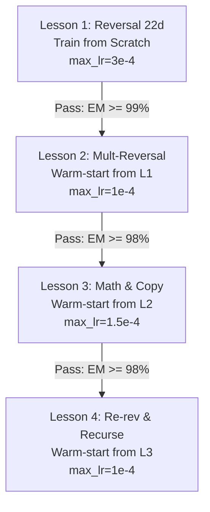

Now can you create an implementation plan and a training plan. I want to know how to train each lesson, what should be LR and how it should change, how we should test each lesson before we start another one etc. I want to keep blocksize 384, so make sure no inputs + outputs exceed 380 tokens when we generate it. 
We should create a new folder rpn_lessons parallel to rpn3_llm so we have a clean start. just copy the code we need and modify there

---

## 1. Analysis of the Phase Mask Transitive Routing Constraint

### The Problem in the Old Setup
In RPN problems with 3 or more operands (e.g. `123 456+ 789+`), the phases are:
* **Phase 1 (REV1)**: `[REV]321[SEP]654+[SEP]987+`
* **Phase 2 (MATH1)**: `[MATH]3+4+0=7:2+5+0=7:1+6+0=7:[BORROW]0|+`
* **Phase 3 (REV2)**: `[REV]975[SEP]987+`
* **Phase 4 (MATH2)**: `[MATH]5+7+0=12...`

Our sequential phase mask restricts the lookback window to `phase_diff <= 1` (current phase + immediately preceding phase). 
* When the model is in **Phase 3 (REV2)**, it needs to output the remaining operand `987+`.
* However, Phase 3 is blocked from directly attending to Phase 1 (`phase_diff = 2`).
* Previously, the model was forced to transitively route the representation of `987+` through the hidden states (residual stream) of Phase 2 (`[MATH]` steps) so Phase 3 could attend to Phase 2.
* Storing passive operand digits in the active math tokens' hidden states created a major capacity bottleneck and caused positional blur/hallucinations for long sequences or many operands.

### The Solution: Text-Based Operand Buffer Copying
The new curriculum data structure physically copies any remaining operands to the end of the current phase output:
* **Phase 1 (REV1)**: `[REV]321[SEP]654+[SEP]987+`
* **Phase 2 (MATH1)**: `[MATH]3+4+0=7:2+5+0=7:1+6+0=7:[BORROW]0|+[SEP]987+` (appended to MATH)
* **Phase 3 (REV2)**: `[REV]975[SEP]987+` (appended to next REV)

With this copy mechanism:
1. During Phase 2, the model copies `[SEP]987+` from Phase 1 (`phase_diff = 1`, allowed).
2. During Phase 3, the model copies `[SEP]987+` from Phase 2 (`phase_diff = 1`, allowed).
3. The remaining operands are carried forward physically in the token sequence (text buffer), freeing up the model's hidden states entirely to focus on local computation.

---

## 2. Directory Structure (`rpn_lessons/`)

We will create a clean codebase under `rpn_lessons/` with the following structure:
```
gptFromScratch/
├── rpn3_llm/             # (Existing codebase)
└── rpn_lessons/          # (New clean curriculum start)
    ├── rpn-tokenizer.json
    ├── model_rope.py     # Copied model architecture (universal, coordinate heads, etc.)
    ├── utils.py          # Modified DataLoaderLite supporting delimiter-based masking
    ├── generate_data.py  # Dataset generator for Lessons 1, 2, 3, and 4
    ├── train.py          # Central training script supporting warm-starts and schedules
    └── val.py            # Evaluation script for exact match accuracy calculations
```

---

## 3. Curriculum Data Specification & Token Constraints

To prevent sequence lengths from exceeding the `block_size = 384` constraint, all generated dataset samples (input + output) will be strictly capped at **380 tokens**. 

### Lesson 1: Single Number Reversal
* **Description**: Reversal of positive and negative numbers up to 22 digits.
* **Format**: `[REV]<num>[ANS]<num_reversed>[EOS]`
* **Prompt Delimiter**: `[ANS]`
* **Max Length**: 48 tokens.
* **Examples**:
  * `[REV]123456[ANS]654321[EOS]`
  * `[REV]-98702[ANS]-20789[EOS]`

### Lesson 2: Reversal of Multiple Numbers
* **Description**: Reversal of 1 to 6 operands (up to 9 digits each) with RPN operators.
* **Format**: `[BOS]<num1> <num2><op1> ... <numN><opN-1>[REV]<num1_rev>[SEP]<num2_rev><op1>[SEP]...<numN_rev><opN-1>[MATH]`
* **Prompt Delimiter**: `[REV]`
* **Max Length**: ~145 tokens.
* **Examples**:
  * `[BOS]123 456+[REV]321[SEP]654+[MATH]`
  * `[BOS]-12 34- 56+[REV]-21[SEP]43-[SEP]65+[MATH]`

### Lesson 3: Step-by-Step Single Math Operation & Operand Copying
* **Description**: Compute the step-by-step scratchpad math of the first two reversed operands, then copy the remaining operands.
* **Format**: `[REV]<num1_rev>[SEP]<num2_rev><op1>[SEP]<num3_rev><op2>...[MATH]<math steps>[SEP]<num3_rev><op2>...[REV]`
* **Prompt Delimiter**: `[MATH]`
* **Max Length**: ~275 tokens.
* **Examples**:
  * `[REV]321[SEP]654+[SEP]987+[MATH]3+4+0=7:2+5+0=7:1+6+0=7:[BORROW]0|+[SEP]987+[REV]`
  * `[REV]12[SEP]34-[MATH]2-4-0=8:1-3-1=7:[BORROW]1|-` (no remaining operands, so no copying)

### Lesson 4: Result Reversal & Phase Transition
* **Description**: Reverse the math result scratchpad output, copy remaining operands, and output either `[MATH]` (recursing) or `[ANS]` (finished).
* **Format**: `[MATH]<math steps>[SEP]<num3_rev><op2>...[REV]<reversed_result>[SEP]<num3_rev><op2>...[MATH]` (or `[ANS]` if no remaining operands).
* **Prompt Delimiter**: `[REV]`
* **Max Length**: ~260 tokens.
* **Examples**:
  * `[MATH]3+4+0=7:2+5+0=7:1+6+0=7:[BORROW]0|+[SEP]987+[REV]975[SEP]987+[MATH]`
  * `[MATH]2-4-0=8:1-3-1=7:[BORROW]1|-[REV]-87[ANS]`

---

## 4. Modified `DataLoaderLite` Masking Logic

In `utils.py`, `DataLoaderLite` will be modified to support a configurable `delimiter_token` argument so that prompt-target boundaries are customized per lesson:

```python
class DataLoaderLite:
    def __init__(self, B, T, input_path, tokenizer=None, delimiter_token="?"):
        ...
        self.delimiter_token = delimiter_token
        ...
        
    def _create_binary_cache(self, input_path, bin_path, mask_path):
        ...
        sep_id = self.tokenizer.vocab.get(self.delimiter_token)
        ...
        # Mask: 0 for all tokens up to and including sep_id, 1 for solution tokens afterwards
```

---

## 5. Training Plan & Learning Rate Schedules

All lessons will use the **Universal Transformer** config: 2 Layers, 8 Heads, 384 Embedding Dimension, 4 MLP ratio, sequential phase masking, and 2 Coordinate Heads. 
We will train using **AdamW** with cosine decay and grad clipping.



### Lesson-by-Lesson Training Configurations

| Parameter | Lesson 1 (Reversal) | Lesson 2 (Multi-Rev) | Lesson 3 (Math & Copy) | Lesson 4 (Transition) |
| :--- | :--- | :--- | :--- | :--- |
| **Max LR** | `3e-4` | `1e-4` (keep scale safe) | `1.5e-4` (new skill) | `1e-4` |
| **Min LR** | `3e-5` | `1e-5` | `1.5e-5` | `1e-5` |
| **Warmup Steps** | 1,000 | 1,000 | 1,000 | 1,000 |
| **Total Steps** | 40,000 | 40,000 | 80,000 | 40,000 |
| **Batch Size** | 32 (B=16, Accum=2) | 32 (B=16, Accum=2) | 32 (B=16, Accum=2) | 32 (B=16, Accum=2) |
| **Initialization**| Scratch | Warm-start from L1 | Warm-start from L2 | Warm-start from L3 |
| **Delimiter** | `[ANS]` | `[REV]` | `[MATH]` | `[REV]` |

---

## 6. Validation & Gating Plan

We will evaluate the checkpoint at the end of training for each lesson using `val.py` performing autoregressive generation (greedy decoding) rather than teacher-forcing loss.

### Passing Criteria for Gating Transitions
1. **Lesson 1 Gate**: Exact match accuracy $\ge 99\%$ on 10,000 validation sequences (length 1 to 22 digits).
2. **Lesson 2 Gate**: Exact match accuracy $\ge 98\%$ on 5,000 validation sequences (1 to 6 numbers, length 1 to 9 digits).
3. **Lesson 3 Gate**: Exact match accuracy $\ge 98\%$ on 5,000 validation sequences (math steps + correct remaining operand copying).
4. **Lesson 4 Gate**: Exact match accuracy $\ge 99\%$ on 5,000 validation sequences (result reversal + remainder copying + correct end token transition).

### Verification Command Execution Flow
When running validation:
```bash
uv run rpn_lessons/val.py --lesson 1 --checkpoint rpn_lessons/models/lesson1_final.pt
```
If the gate is passed, training for the next lesson is launched using the `--checkpoint` argument to load the previous checkpoint's weights.

---

## 7. Current Progress & Training History

### Lesson 1: Reversal (Complete)
* **Status**: Completed at 40,000 steps.
* **Checkpoint**: `rpn_lessons/models/lesson1_step40000.pt`
* **Validation Results**: Obtained **100.00% exact match accuracy** on 1,000 validation prompts using `val.py`.
* **Gating Status**: **PASSED** (Gate: $\ge 99.0\%$).
* **Execution Parameters**: `batch_size = 64`, `grad_accum_steps = 1`, `T = 384`. Hitting ~100,000 tokens/second on MPS.
* **Transition**: Ready for Lesson 2.

### Lesson 2: Multi-Reversal (Complete)
* **Status**: Completed at 40,000 steps.
* **Checkpoint**: `rpn_lessons/models/lesson2_step40000.pt`
* **Validation Results**: Obtained **100.00% exact match accuracy** on 500 validation prompts for both Lesson 2 and Lesson 1.
* **Gating Status**: **PASSED** (Gate: $\ge 98.0\%$).
* **Execution Parameters**: `batch_size = 64`, `grad_accum_steps = 1`, `T = 384`.
* **Transition**: Ready for Lesson 3.
