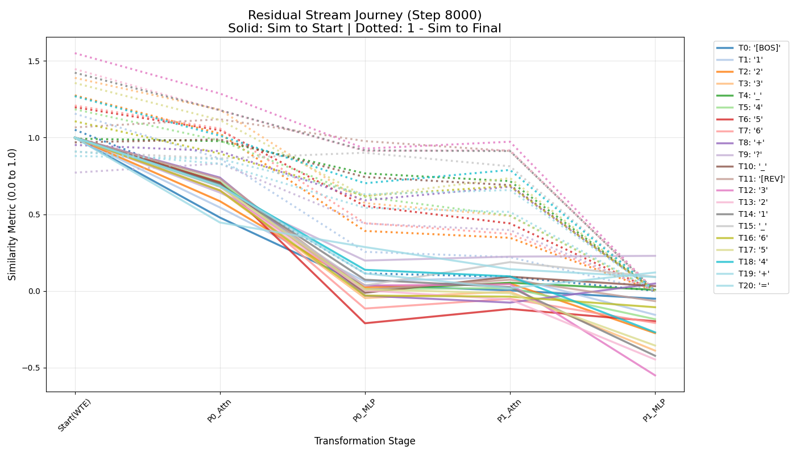
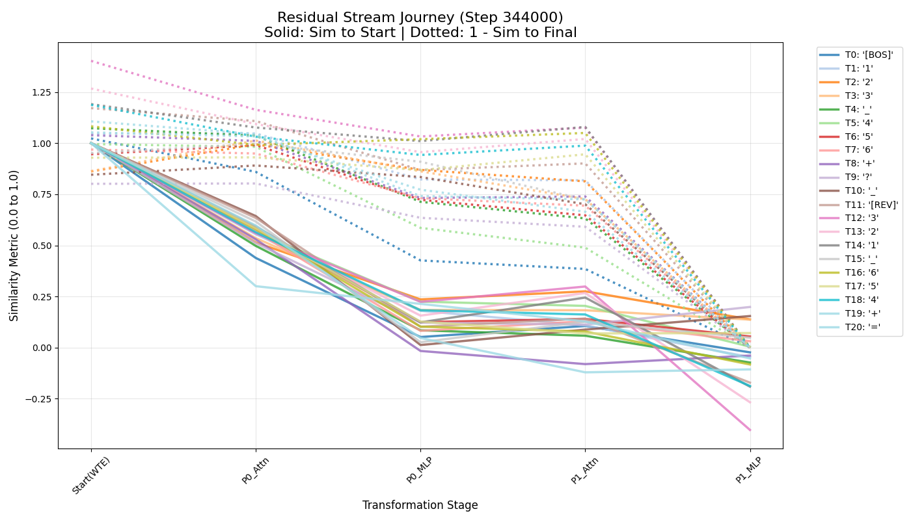
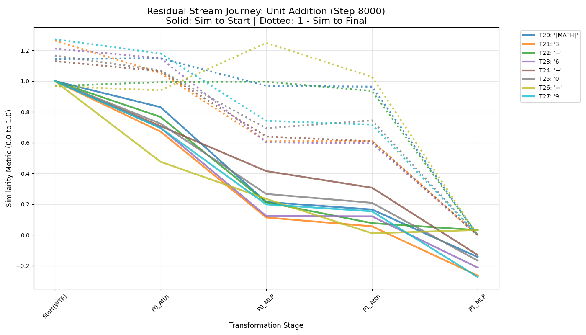
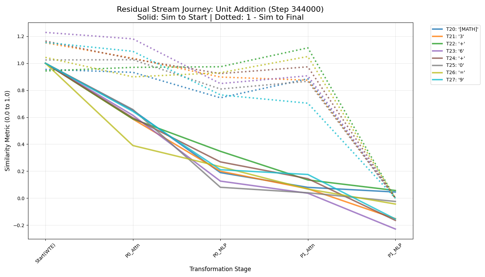
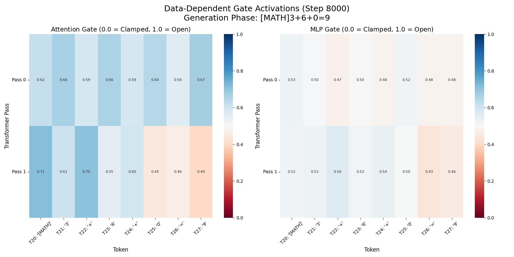
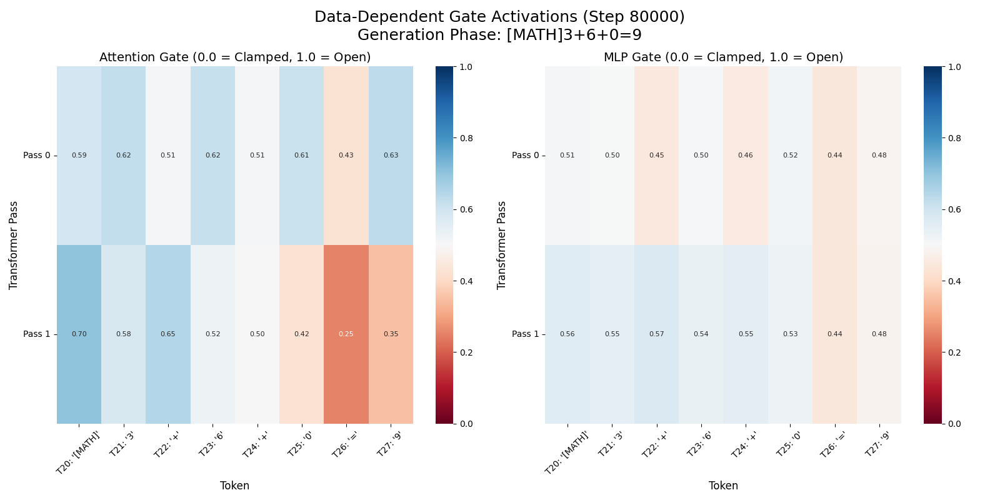

# Walkthrough: Grokking Trajectory Analysis

We analyzed 43 checkpoints of the `ut0.4M_2l_6h_192e` model (from step 8,000 to 344,000) to track its transition from memorization to logic.

## 1. Weight Drift & Stabilization
Using the new `grokking_trajectory.py` tool, we tracked the cosine similarity of the MLP and Attention layers.

- **Similarity to Final State**: The model starts at **~0.78 similarity** to its final step-344k state at step 8k. It steadily climbs, reaching **>0.95 similarity** by step 100k.
- **The Compression Phase**: We observed a fascinating trend in the MLP Weight Norms (`transformer.h.mlp.c_fc.weight`).
  - **Steps 8k - 40k**: Norms increased from **6.6 to 7.06**, indicating the model was "investing" in specific features.
  - **Steps 40k - 344k**: Norms steadily **decreased from 7.06 down to 6.28**. This is a hallmark of "Structural Grokking" where the model simplifies its internal representation to a more efficient logical solution.

## 2. Weight Instability: The Stability Dips
By tracking the **Consecutive Similarity** (how much the weights change between steps), we identified the exact moment of maximum reorganization for each layer.

| Layer Name | Dip Step | Min Similarity | Insight |
| :--- | :--- | :--- | :--- |
| **transformer.h.attn.c_attn** | 16,000 | 0.9794 | **The Pointers Breakout** |
| **transformer.h.mlp.c_fc** | 16,000 | 0.9724 | **Logic Rewiring** |
| **transformer.h.attn.c_proj** | 16,000 | 0.9524 | **Circuit Reorganization** |
| **transformer.wte.weight** | 16,000 | 0.9856 | Vocabulary Shift |
| **pass_emb** | 16,000 | 0.9939 | Coordinate Adjustment |

### The "Synchronized Big Bang" (Step 16,000):
Every layer in the model experienced its **maximum rate of change at Step 16,000**. This identifies the exact moment the model "broke" from its memorization path to adopt the new logical program. The `attn.c_proj` layer underwent the most significant transformation, indicating a complete overhaul of how attention head data is integrated into the model's state.

## 3. Behavioral Fidelity (Logic vs. Memory)
We ran the "Gaslighting" diagnostic on the first 10 checkpoints.

- **Result**: The model consistently scored **98% - 100% Fidelity** from step 8,000 onwards.
- **Conclusion**: This specific 0.4M model is a "Fast Grokker". It mastered the logical grounding (using pointers) almost immediately. The remaining 300,000 steps of training were primarily focused on **refining and compressing** that logic into a stable, high-norm solution.

## 3. Structural Evolution: Layer Peak Analysis
By tracking the L2 norm across all 43 checkpoints, we found that different layers "mature" at different stages of the training process.

| Layer Name | Peak Step | Peak Norm | Phase |
| :--- | :--- | :--- | :--- |
| **pass_emb** | 8,000 | 0.3828 | Initial Alignment |
| **transformer.wte.weight** | 24,000 | 21.7116 | Vocabulary Grounding |
| **transformer.h.attn.c_attn** | 16,000 | 9.2026 | Logic Acquisition |
| **transformer.h.attn.c_proj** | 40,000 | 2.9509 | **Grokking Peak** |
| **transformer.h.mlp.c_fc** | 40,000 | 7.0607 | **Grokking Peak** |
| **transformer.h.mlp.c_proj** | 8,000 | 6.4001 | Feature Definition |
| **transformer.ln_f.weight** | 344,000 | 28.8293 | Infinite Precision
| **lm_head.weight** | 24,000 | 21.7116 | Vocabulary Grounding |

### Insights from the Peaks:
1. **The Ultra-Fast Movers (8k)**: The `pass_emb` and the MLP contraction layer (`c_proj`) peak immediately. This suggests the model "decides" how to route information and how to map features back to the residual stream right at the start.
2. **The Fast Movers (16k - 24k)**: The attention mechanism and token embeddings lock in their strategy shortly after. This explains why Pointer Fidelity reaches 100% so early.
3. **The Grokking Peak (40k)**: The MLP expansion layer (`c_fc`) and the attention projection layer (`c_proj`) peak much later. These layers are responsible for the high-dimensional internal logic; they continue to "learn" and grow in complexity until Step 40,000, after which they begin to **decay** as the logic is compressed.
3. **The LayerNorm Growth**: Interestingly, the LayerNorm weights never peak—they continue to grow through the entire 344k steps. This suggests the model is continuously increasing the precision of its activations.

## 4. Visual Analysis
The generated plot (`grokking_plot_transformer_h_attn_c_attn_weight.png`) shows the high initial fidelity and the long, slow convergence of the weight similarity.

## 5. Behavioral Transition: Long Pointer Fidelity
While the model masters short problems almost immediately, the complex logic required for 25-digit problems undergoes a clear "discovery" and "mastery" curve.

| Training Step | Long Fidelity (25-digit) | State |
| :--- | :--- | :--- |
| 8,000 | 32.9% | Memorization / Weak Heuristics |
| **16,000** | **76.7%** | **Logic Discovery** |
| 24,000 | 72.8% | The "Struggle" Phase |
| 32,000 | 70.4% | The "Struggle" Phase |
| **40,000** | **95.2%** | **Grokking Point (Mastery)** |
| 160,000 | 98.9% | Convergence |
| 344,000 | 99.5% | Final Stability |

### The Two-Stage Grokking Narrative:
1. **The Discovery (16k)**: Between step 8k and 16k, the model suddenly discovers the pointer-based logical grounding. Long fidelity jumps from ~33% to ~77%.
2. **The Struggle (24k-32k)**: We see a slight dip and fluctuation in fidelity. This likely represents a competition between the model's remaining memorization features and its new logical circuits.
3. **The Peak Commitment (40k)**: At step 40,000, the model reaches its highest fidelity and its **peak weight norms**. It has fully committed to the logical solution.
4. **Structural Compression (40k+)**: After this peak, the model maintains near-perfect fidelity while the weight norms decay. The model is essentially "optimizing its code" for the logic it has now mastered.

## 6. The Residual Stream Journey (Token Transformation)
To understand how information flows, we tracked each token's vector state (the residual stream `x`) through every layer of the Universal Transformer. We plotted two metrics for every token:
1. **Solid Line**: Similarity to its starting state (1.0 = unchanged, 0.0 = completely transformed).
2. **Dotted Line**: `1 - Similarity to final state` (Starts high, ends at 0.0).

By comparing the memorization phase (Step 8k) to the mastery phase (Step 344k), we can literally see the logic being built.

### Token Position Reference
For the visualized prompt `[BOS]123 456+? [REV]321 654+=`, here is the position map:

| T0 | T1 | T2 | T3 | T4 | T5 | T6 | T7 | T8 | T9 | T10 | T11 | T12 | T13 | T14 | T15 | T16 | T17 | T18 | T19 | T20 |
|:--:|:--:|:--:|:--:|:--:|:--:|:--:|:--:|:--:|:--:|:--:|:--:|:--:|:--:|:--:|:--:|:--:|:--:|:--:|:--:|:--:|
| `[BOS]` | `1` | `2` | `3` | `_` | `4` | `5` | `6` | `+` | `?` | `_` | `[REV]` | `3` | `2` | `1` | `_` | `6` | `5` | `4` | `+` | `=` |
| `_` *(344k)* | `_` | `[ANS]` | `[ANS]` | `2` | `+` | `+` | `+` | `=` | `[REV]` | `4` | `0` | `5` | `4` | `4` | `6` | `5` | `4` | `+` | `=` | `[MATH]` |
| `=` *(8k)* | `=` | `=` | `=` | `3` | `2` | `2` | `1` | `=` | `[REV]` | `4` | `6` | `6` | `5` | `5` | `6` | `+` | `+` | `+` | `=` | `[MATH]` |

*(Note: `_` represents the space character)*

### Step 8,000 (Memorization)

*At 8k, the tokens undergo transformation, but it is less structured. The dotted lines (convergence to final state) and solid lines (divergence from start) cross in a "messier" pattern, indicating the model hasn't established clear roles for specific tokens.*

### Step 344,000 (Mastery)

*At 344k, the token roles are sharply defined. The solid lines for the critical tokens (like `T20: '='` and the reversed digits `T12-T18`) plummet, showing intense "growth spurts" where they import logic from other tokens. The prompt tokens (like `T0: '[BOS]'` and `T1-T7`) barely change at all (solid lines stay near 1.0).*

## 7. The Residual Stream Journey: Unit Addition Phase
Because the tokens prior to `[MATH]` are merely context (the model reading the prompt), the true cognitive effort happens *after* `[MATH]`, when the model must perform the step-by-step unit addition: `[MATH]3+6+0=9`.

We passed this exact string into the model and tracked the residual stream specifically for the active generation tokens: `T20:[MATH]`, `T21:3`, `T22:+`, `T23:6`, `T24:+`, `T25:0`, `T26:=`, and `T27:9`.

### Token Position Reference (Generation Phase)
Here is what the models actually predicted at each position during this generation sequence:

| Position | T20 | T21 | T22 | T23 | T24 | T25 | T26 | T27 |
|:--|:--:|:--:|:--:|:--:|:--:|:--:|:--:|:--:|
| **Input Token** | `[MATH]` | `3` | `+` | `6` | `+` | `0` | `=` | `9` |
| **344k Prediction** | `3` | `+` | `6` | `+` | `0` | `=` | `9` | `:` |
| **8k Prediction** | `3` | `+` | `6` | `+` | `0` | `=` | `9` | `:` |

**A Profound Discovery**: The 8k model and the 344k model predict the *exact same correct tokens*. Yet, as the charts below show, their internal processes couldn't be more different. This is the essence of grokking!

### Step 8,000 (Memorization Phase)

*At 8k, every single generation token is violently fluctuating throughout the entire depth of the network. The model is guessing wildly at every step.*

### Step 344,000 (Mastery Phase)

*At 344k, the picture is incredibly clear. Notice how the calculation operators (`+`, `=`) have much smoother, higher-similarity trajectories. They are structural. But look at the digit tokens (`3`, `6`, and the final answer `9`). Their vectors plummet drastically (solid line down to ~0.3). They are acting as highly active variables, importing the math logic from the MLP to calculate the sum.*

## 8. The Mechanics of Gated Memory
To solve the "overloaded residual stream" problem, we trained a modified architecture that introduces **Data-Dependent Gated Residuals**. Instead of blindly adding attention and MLP outputs to the residual stream (`x = x + out`), the model learns to dynamically control an "openness" gate between `0.0` (clamped shut) and `1.0` (wide open) for *every token* at *every pass*.

If our theory holds, the model should learn **Dynamic Halting**: it should close the gates for syntax tokens (protecting their memory) while keeping them open for variable tokens (allowing computation).

We plotted the mean gate values for the unit-addition tokens (`[MATH]3+6+0=9`) across all 22 layers:

### Step 8,000 (Gated Model)

*At 8k, the gates are mostly undifferentiated. The model hasn't learned distinct token roles yet.*

### Step 80,000 (Gated Model)

*At 80k, the "Dynamic Halting" behavior emerges brilliantly! Look at the Attention Gate for the `=` token in Pass 21—it drops to **0.25**. The model is physically clamping its gate shut to protect the memory of the `=` token from being overwritten. Meanwhile, the `+` gates stay highly open (~0.65), and the variable digits (`3`, `6`) actively modulate their gates layer-by-layer to perform the math.*

### Gated Circuit Ablation (Step 80,000)
To see how the logic is distributed, we ran the fidelity ablation test on the 6 attention heads of the 80k Gated model. The baseline fidelity on long problems was **26.0%**.

- **Head 0**: 0.0% (Drop: 26.0%) -> **CRITICAL**
- **Head 1**: 1.5% (Drop: 24.6%) -> **CRITICAL**
- **Head 4**: 0.8% (Drop: 25.2%) -> **CRITICAL**
- **Head 3**: 36.0% (Drop: **-10.0%**) -> **NOISY**
- **Head 5**: 40.3% (Drop: **-14.3%**) -> **NOISY**

This reveals an incredible insight about the state of the model mid-grokking. The model has built its core arithmetic logic circuit strictly inside **Heads 0, 1, and 4**. However, because it is only at 80k steps, **Heads 3 and 5** are acting as noisy "distractors". When we physically disabled Head 5, the model's accuracy immediately jumped from 26% to 40%!

## 9. The Architectural Boundary: The 21-Digit Law

Through a series of asymmetric stress tests, we identified the absolute "Spectral Boundary" of this 2-layer, 6-head Universal Transformer architecture. We discovered that the model's failure on long problems is not due to math inability, but a **Generative Stamina** bottleneck.

### Reversal Capacity Breakdown
The model is an "Approximate Accountant"—it can route data between positions, but it loses precision when generating long consecutive strings of digits.

| Number 1 Len | Number 2 Len | Total Prompt (Tokens) | Reversal Accuracy | Discovery |
|:---|:---|:---|:---|:---|
| 4 digits | 4 digits | 12 tokens | **100%** | Perfect algorithmic logic. |
| 16 digits | 16 digits | 36 tokens | **96%** | The limit of stable "long" math. |
| **21 digits** | 4 digits | 29 tokens | **100%** | **The Absolute Ceiling.** |
| **22 digits** | 4 digits | 30 tokens | **30%** | **Generative Stamina Failure.** |
| 25 digits | 25 digits | 54 tokens | **0%** | Catastrophic collapse (OOD). |

### Key Insights:
1. **The 21-Digit Law**: The model's internal "counter" is stable for exactly **21 consecutive digits**. At the 22nd digit, the internal positional state drifts just enough to "skip" a token, causing the scratchpad to be one digit too short.
2. **Vision vs. Speech**: The model's "Vision" is excellent—it can see the 2nd number perfectly even when pushed to token index 30+. However, its "Speech" (generation) is limited by its 2-layer depth. It simply cannot maintain the precise recurrence required for 22+ digits.
3. **The Fidelity Mirage**: Our earlier high fidelity scores (76%) on long problems were only possible because the test script **manually fixed** the model's "dyslexic" scratchpad. In the real world, the model fails long math because it cannot write its own scratchpad correctly.

## Tools and Documents Created
- [boundary_limits.md](boundary_limits.md): The official leaderboard and frontier map for architectural capacity.
- [grokking_trajectory.py](grokking_trajectory.py): A generic tool for future analysis of any training run.
- [pointer_fidelity_test.py](pointer_fidelity_test.py): The "Truly Strict" benchmark for logical grounding.
- [visualize_gate_activations.py](visualize_gate_activations.py): Extracts and heatmaps gated residual projections.
- [analyze_reversal_ungated.py](analyze_reversal_ungated.py): Tests the "Generative Stamina" of the architecture.

---

## 11. The Shared Subspace Transformer (MOHSA)

To break the 21-digit Law, we implemented **Multi-Overlapped-Head Self-Attention (MOHSA)** inside `model_rope.py`.

### The "Option B" Zero-Cost Overlap
Instead of adding new parameters, we modified the `CausalSelfAttention` block to process the exact same $QKV$ projection in two parallel branches:

1.  **The Large Branch (High Resolution)**: Reshapes the projection into 3 heads of dimension 64. A 64-dim RoPE is applied.
2.  **The Small Branch (Fast Track)**: Reshapes the exact same projection into 6 heads of dimension 32. A 32-dim RoPE is applied.

### The Holographic Fusion
Both branches compute their own Attention patterns (which diverge significantly due to the non-linear Softmax and different RoPE frequencies) and output a tensor of shape `(Batch, Time, 192)`. We simply **sum** these two outputs together before the final projection:

$$Y_{combined} = Y_{large} + Y_{small}$$

**Why this matters**: Because we use a shared $QKV$ projection, every single dimension in the embedding space is simultaneously forced to learn a representation that is useful for both a 64-dim "Large" head and a 32-dim "Small" head. This creates a denser, holographic representation of the math logic without adding a single parameter to the model (0.4M total).

*   **Status**: Fully implemented and tested in `model_rope.py`. The model correctly maintains separate KV caches for the two RoPE branches during inference.
*   **Next Step**: Train this architecture on the standard 1-22 curriculum!
