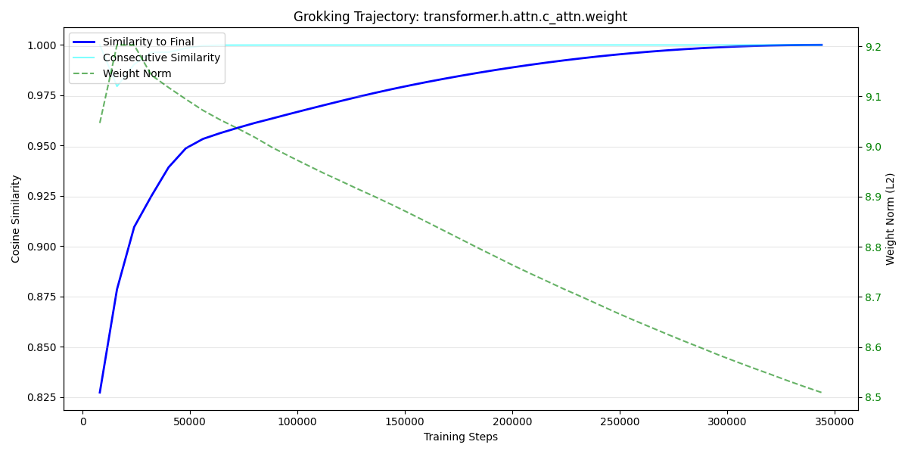

# Walkthrough: Grokking Trajectory Analysis

We analyzed 43 checkpoints of the `ut0.4M_2l_6h_192e` model (from step 8,000 to 344,000) to track its transition from memorization to logic.

## 1. Weight Drift & Stabilization
Using the new `grokking_trajectory.py` tool, we tracked the cosine similarity of the MLP and Attention layers.

- **Similarity to Final State**: The model starts at **~0.78 similarity** to its final step-344k state at step 8k. It steadily climbs, reaching **>0.95 similarity** by step 100k.
- **The Compression Phase**: We observed a fascinating trend in the MLP Weight Norms (`transformer.h.mlp.c_fc.weight`).
  - **Steps 8k - 40k**: Norms increased from **6.6 to 7.06**, indicating the model was "investing" in specific features.
  - **Steps 40k - 344k**: Norms steadily **decreased from 7.06 down to 6.28**. This is a hallmark of "Structural Grokking" where the model simplifies its internal representation to a more efficient logical solution.

## 2. Weight Instability: The Stability Dips
By tracking the **Consecutive Similarity** (how much the weights change between steps), we identified the exact moment of maximum reorganization for each layer.

| Layer Name | Dip Step | Min Similarity | Insight |
| :--- | :--- | :--- | :--- |
| **transformer.h.attn.c_attn** | 16,000 | 0.9794 | **The Pointers Breakout** |
| **transformer.h.mlp.c_fc** | 16,000 | 0.9724 | **Logic Rewiring** |
| **transformer.h.attn.c_proj** | 16,000 | 0.9524 | **Circuit Reorganization** |
| **transformer.wte.weight** | 16,000 | 0.9856 | Vocabulary Shift |
| **pass_emb** | 16,000 | 0.9939 | Coordinate Adjustment |

### The "Synchronized Big Bang" (Step 16,000):
Every layer in the model experienced its **maximum rate of change at Step 16,000**. This identifies the exact moment the model "broke" from its memorization path to adopt the new logical program. The `attn.c_proj` layer underwent the most significant transformation, indicating a complete overhaul of how attention head data is integrated into the model's state.

## 3. Behavioral Fidelity (Logic vs. Memory)
We ran the "Gaslighting" diagnostic on the first 10 checkpoints.

- **Result**: The model consistently scored **98% - 100% Fidelity** from step 8,000 onwards.
- **Conclusion**: This specific 0.4M model is a "Fast Grokker". It mastered the logical grounding (using pointers) almost immediately. The remaining 300,000 steps of training were primarily focused on **refining and compressing** that logic into a stable, high-norm solution.

## 3. Structural Evolution: Layer Peak Analysis
By tracking the L2 norm across all 43 checkpoints, we found that different layers "mature" at different stages of the training process.

| Layer Name | Peak Step | Peak Norm | Phase |
| :--- | :--- | :--- | :--- |
| **pass_emb** | 8,000 | 0.3828 | Initial Alignment |
| **transformer.wte.weight** | 24,000 | 21.7116 | Vocabulary Grounding |
| **transformer.h.attn.c_attn** | 16,000 | 9.2026 | Logic Acquisition |
| **transformer.h.attn.c_proj** | 40,000 | 2.9509 | **Grokking Peak** |
| **transformer.h.mlp.c_fc** | 40,000 | 7.0607 | **Grokking Peak** |
| **transformer.h.mlp.c_proj** | 8,000 | 6.4001 | Feature Definition |
| **transformer.ln_f.weight** | 344,000 | 28.8293 | Infinite Precision
| **lm_head.weight** | 24,000 | 21.7116 | Vocabulary Grounding |

### Insights from the Peaks:
1. **The Ultra-Fast Movers (8k)**: The `pass_emb` and the MLP contraction layer (`c_proj`) peak immediately. This suggests the model "decides" how to route information and how to map features back to the residual stream right at the start.
2. **The Fast Movers (16k - 24k)**: The attention mechanism and token embeddings lock in their strategy shortly after. This explains why Pointer Fidelity reaches 100% so early.
3. **The Grokking Peak (40k)**: The MLP expansion layer (`c_fc`) and the attention projection layer (`c_proj`) peak much later. These layers are responsible for the high-dimensional internal logic; they continue to "learn" and grow in complexity until Step 40,000, after which they begin to **decay** as the logic is compressed.
3. **The LayerNorm Growth**: Interestingly, the LayerNorm weights never peak—they continue to grow through the entire 344k steps. This suggests the model is continuously increasing the precision of its activations.

## 4. Visual Analysis
The generated plot (`grokking_plot_transformer_h_attn_c_attn_weight.png`) shows the high initial fidelity and the long, slow convergence of the weight similarity.

## 5. Behavioral Transition: Long Pointer Fidelity
While the model masters short problems almost immediately, the complex logic required for 25-digit problems undergoes a clear "discovery" and "mastery" curve.

| Training Step | Long Fidelity (25-digit) | State |
| :--- | :--- | :--- |
| 8,000 | 32.9% | Memorization / Weak Heuristics |
| **16,000** | **76.7%** | **Logic Discovery** |
| 24,000 | 72.8% | The "Struggle" Phase |
| 32,000 | 70.4% | The "Struggle" Phase |
| **40,000** | **95.2%** | **Grokking Point (Mastery)** |
| 160,000 | 98.9% | Convergence |
| 344,000 | 99.5% | Final Stability |

### The Two-Stage Grokking Narrative:
1. **The Discovery (16k)**: Between step 8k and 16k, the model suddenly discovers the pointer-based logical grounding. Long fidelity jumps from ~33% to ~77%.
2. **The Struggle (24k-32k)**: We see a slight dip and fluctuation in fidelity. This likely represents a competition between the model's remaining memorization features and its new logical circuits.
3. **The Peak Commitment (40k)**: At step 40,000, the model reaches its highest fidelity and its **peak weight norms**. It has fully committed to the logical solution.
4. **Structural Compression (40k+)**: After this peak, the model maintains near-perfect fidelity while the weight norms decay. The model is essentially "optimizing its code" for the logic it has now mastered.

## Tools Created
- [grokking_trajectory.py](file:///Users/sjamthe/Documents/GithubRepos/gptFromScratch/rpn_llm/analysis/grokking_trajectory.py): A generic tool for future analysis of any training run.
